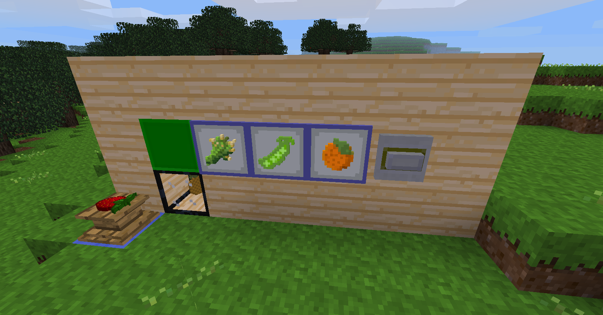
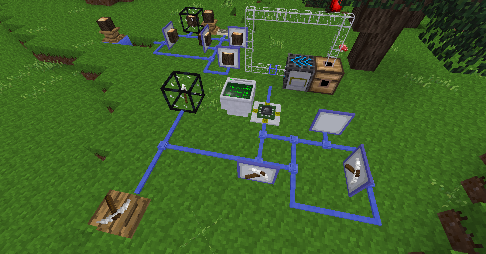

# Digiframe

A **minetest** mod for digiline-enabled item frames.

The basic idea behind this mod is to have nodes that display an item set via digilines.

Dependencys:
- default, digilines
- (optional) screwdriver, mesecons_mvps
- (optional) itemframes - part of the "homedecor" modpart, and only used for crafting recipes.

## Nodes

This mode provide 3 nodes:
- "Digiline frame", which is similar to homedecor's "itemframe", displaying an item in the front of a thin panel.
  - Craft (shapeless): itemframe, digiline wire.
  - Digiline wiring: back side
- "Digiline pedestal", displaying an item over an half-sized node (slap), in a way similar to anvils. Actually, itt tries to be clever, flat objects being displayed turned upwards (as on an anvil indeed), but cubic object being represented in their usual upright orientation.
  - Craft (shapeless): itemframe, digiline wire, any item belonging to the wood group.
  - Digiline wiring: any side, or bottom
- "Digiline glass", where the item is displayed inside the node (assumingly transparent, glass-like), rotating
  - Craft (shapeless); itemframe, digiline wire, obsidian glass.
  - Digiline wiring: any side
  
The digiline channel is set via right-click as usual.


  
## Digiline control

To display an item, send over the appropriate channel the "set" command, with the required itemstring as "item":
```
{ cmd = "set", item = "default:tree" }
```

To keep friendly with keyboards, digiline detector channels, etc. one can also send simply an itemstring.

To retrieve the currently displayed item, send a "get" command:
```
{ cmd = "get" }
```

The nodes emits two types of events on their channel:

The "get" event is emitted as the result of a previous "get" command:
```
{ event = "get", item = "default:tree" }
```

The "notify" event is emitted when the displayed item is changed:
```
{ event = "notify", item = "default:tree" }
```

## API

The mod also provides an API for registering new digiline-enabled nodes, e.g.
```
digiframe.register_node(nodename, nodedata)
```

Where:
- _nodename_ is the itemstring for the new name
- _nodedata_ is the definition for the visual aspect of the node (description, draw type and associated fields, parameters, groups), with all behavior callbacks left aside, as the mod will provide these.
- In the groups, the `digiframe` level must be set, with one of the following values
  - 1: Thin frame-like node (same depth as an homedecor itemframe) = item is displayed slightly extruded; digiline wiring is from the back of the frame.
  - 2: Full block (assumingly glass-like) = item is displayed inside the node and rotates over the Y-axis; digiline wiring is from any side.
  - 3: Half block = item is displayed on the half-block top; digiline wiring is from any side, or bottom.

E.g.
```
digiframe.register_node("mynode:aquarium", {
  description = S("Digiline aquarium"),
  drawtype = "glasslike_framed",
  tiles = {
    "default_obsidian_glass.png", -- sides
    "default_glass_detail.png", -- shine/details
  },
  special_tiles = {{
    name = "default_water_source_animated.png",
    animation = {
      type = "vertical_frames",
      aspect_w = 16,
      aspect_h = 16,
      length = 2.0,
    }}
  },
  use_texture_alpha = true,
  sunlight_propagates = true,
  paramtype = "light",
  paramtype2 = "glasslikeliquidlevel",
  place_param2 = 50,
  groups = { cracky = 3, oddly_breakable_by_hand=3, digiframe=2 },
  sounds = default.node_sound_glass_defaults(),
})
```

There might be other things in the `digiframe` object, but they are not considered mature enough (and hence subject to changes), so are not part of the public API.


