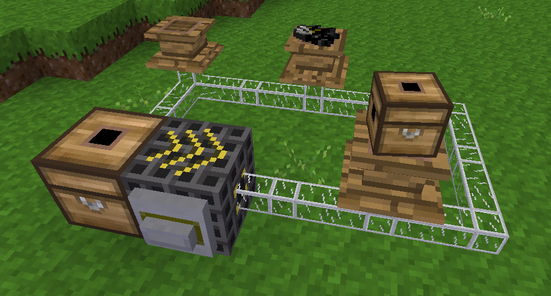

# Tubeframe

A **minetest** mod for (pipeworks') tube-enabled item frames.

The basic idea behind this mod is to have item frames which content was injected
via a tube.

Dependencies:
- `default`, `pipeworks`, `framing_api`
- (optional) `itemframes` - part of the "homedecor" modpack, and only used for crafting recipes.

Compared to regular itemframes, the tube-enabled frames don't have a owner. This means that
any player punching or right-clicking the node can retrieve the displayed item. It is under
the responsability of the owner of the tubes and injection logic to ensure they use these 
frames knowingly.

The frames only accept items if they are empty.

The infotext is set to the name of the displayed item, followed by "(framed)".

## Nodes

This mod provides 1 nodes:
- "Tube-enabled pedestal", displaying an item over an half-sized node (slab), in a way similar to anvils. Actually, it tries to be clever, flat objects being displayed turned upwards (as on an anvil, indeed), but cubic object being represented in their usual upright orientation.
  - Craft (shapeless): itemframe, tube, any item belonging to the wood group.
  - Tube wiring: bottom



## API

The mod also provides an API for registering new tube-enabled nodes, e.g.
```
tubeframe.register_node(nodename, nodedata)
```

Where:
- _nodename_ is the name (itemstring) for the new node.
- _nodedata_ is the definition for the visual aspect of the node (description, draw type and associated fields and tiles, parameters, groups, sounds, etc.), with all behavior callbacks and pipeworks declarations left aside, as the mod will provide these.
- In the groups, the `tubeframe` level must be set, with one of the following values:
  - 1: Thin frame-like node (same depth as an homedecor itemframe) = item is displayed slightly extruded.
  - 2: Full block (assumingly glass-like) = item is displayed inside the node and rotates over the Y-axis.
  - 3: Half block = item is displayed on the half-block top.

As of version 1.0, there might be other things in the `tubeframe` object, but they are not considered mature enough (and hence, are subject to changes), so are not part of the public API. You may however check `tubeframe.version` (float value as major, minor), to confirm the version of the API. Minor changes should break compatibility, while major changes may introduce breaking changes.
